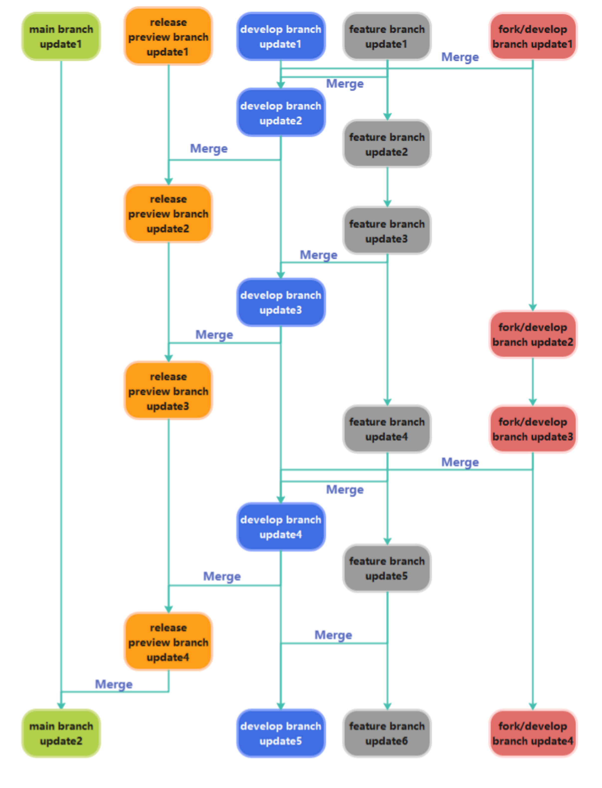
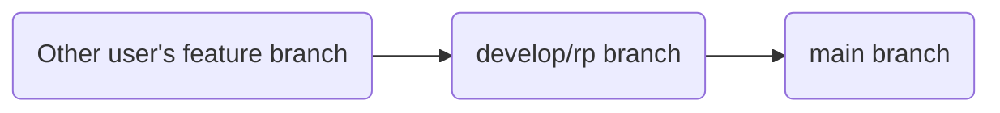

# ❓ How to Contribute?

<div align="center">
    <a href="./CONTRIBUTING.md"></a>
    <a href="./CONTRIBUTING-zh_CN.md"></a>
</div>

## ⬆️ Commit Message

Must follow the format below:

```
UpdateType(Module):(optional)(Version) Summary:

- [(optional) Sub-updateType] Update content 1
- [(optional) Sub-updateType] Update content 2
- ...
```

Update types include:

| Type | Description |
| --- | --- |
| ✅feat | New feature |
| 🔧modify | Modify functionality |
| 🐛fix | Bug fix |
| ⚒️refactor | Refactor |
| 📃docs | Documentation changes (e.g., README) |
| ❇️style | Code style changes, no functional impact |
| 🔎test | Add or modify tests |
| 📆chore | Chores, e.g., modify .gitignore |
| ⏫perf | Performance improvements |
| 🛒ci | CI/CD related changes |
| 🚅build | Build system or dependency changes |
| ◀️revert | Revert changes |
| 🔡dependency | Dependency updates |
| ❌remove | Remove deprecated components |
| ↪️move | Move components |
| ❓unknown | Unknown type |
| custom | Use an intuitive English word, preferably with an emoji |

When there are many updates, add an update type hint for each update item.

## 🗂️ Branches

Please follow the branching structure shown in the image below:



Create branches with the prefix `feature/` to indicate a feature branch, or create a fork and develop on a branch within the fork.

When opening a PR, the target branch is not restricted, as long as it is not the `main` branch.

## 🔠 Version Number

The clickmouse version format is: `A.B.C.D[(alpha | beta | .dev | rc) E]`

## 😊 Official Releases

Official releases do not include the suffixes .dev, alpha, beta, or rc.

- The A digit indicates major updates with code-level changes. For example, upgrading from 1.0 to 2.0 involves a code refactor.
- The B digit indicates regular updates, usually introducing major features.
- The C digit indicates patch updates, typically including minor features and bug fixes.
- The D digit indicates the version codename, incremented whenever A, B, or C change. It may also be incremented without changes to A, B, or C for emergency updates (e.g., fixing several critical bugs).

## 🅱️ Pre-release Versions

Pre-release versions include .dev, alpha, beta, or rc suffixes. Typically, the preceding `A.B.C.D` remains unchanged during a test cycle, representing the next version.

- `.dev` represents early development updates, unstable features, many bugs, at the project's initial stage. New features will be placed in the lab and disabled by default.
- `alpha` represents late development updates, incomplete features, many bugs, at the project's early stage. New features will be placed in the lab and disabled by default.
- `beta` represents release candidate testing updates, complete features, fewer bugs, no new features added, at the project's mid stage, gradually merging lab features.
- `rc` represents a release candidate, complete features, fewer bugs, critical security or bug fixes, closest to the official release, at the project's final stage.

## ❓ Issues

- Title format: `[Type] Title`
- Content should accurately describe your request, optionally provide a solution, upload screenshots, and add additional information (e.g., clickmouse version number).
- Types include `bug`, `enhancement`, `question`, etc.
- We provide templates that can be used directly.
- Use `labels` to mark the issue type, such as `bug`, `enhancement`, `question`, etc.
- Set the issue's `milestone` to the version you intend to apply the issue to.
- For security issues, refer to the [Security Documentation](./SECURITY.md).

## ❇️ Pull Requests

- Title format: `[Type] Title`
- Use `labels` to mark the PR type, such as `bug`, `enhancement`, `question`, etc.
- Link to an issue so we know which issue this PR resolves.
- Accurately describe the changes and link to the version milestone.
- Optionally provide implementation ideas.

### 🎫 Guidelines

The order of PR merging is as follows:



PRs do not have a strict format but must clearly describe the changes, link to the version milestone, and have a title that briefly summarizes the changes. If the PR fixes or implements a suggestion from an issue, include the issue number in that line. For multiple duplicate issues, only write one and briefly describe the bug.

### ✈️ Express PR

> [!WARNING]
> Use express PRs with caution.

- Express PR means skipping some normal PR merge steps to merge into the target branch faster.
- Title format: `[✈️Express] Title`
- You must explain the reason for using an express PR in the PR description.

If someone merges via express PR without stating the reason, the merge will be rejected.

Express PRs have high priority and will be handled first.

## 📊 Milestones

- We set a milestone for each version to manage issues and PRs for that version.
- Each issue or PR must be linked to a milestone so we know whether it will be included in the next version.
- Milestone format: `dev_version_number`

## ⬇️ Setting Up the Repository

1. Clone the repository: `git clone https://github.com/xystudiocode/pyClickMouse.git`
2. For the Python version, install Python (recommended version 3.13, consistent with the software developer's version). [Download link](https://www.python.org/downloads/release/python-31312/)
3. For the header file and DLL versions, you can install [Visual Studio](https://visualstudio.microsoft.com/).

### 🖥️ GUI

1. Download the source code.
2. Place `7z.exe` and `7z.dll` in the `gui` directory.
3. Install Chocolatey:
```powershell
Set-ExecutionPolicy Bypass -Scope Process -Force; [System.Net.ServicePointManager]::SecurityProtocol = [System.Net.ServicePointManager]::SecurityProtocol -bor 3072; iex ((New-Object System.Net.WebClient).DownloadString('https://community.chocolatey.org/install.ps1'))
```
4. Install make:
```powershell
choco install make
```
5. Install Python packages:
```powershell
pip install -r requirements.txt
```
6. Build:
```powershell
make clickmouse   # Build clickmouse
make extension    # Build extension
make clickclean   # Use this if you want to build the slim version
```
7. Run `dist/clickmouse/clickmouse/main.exe` to load clickmouse.

### 🥴 Header Files

You only need to modify the header files to call the library.

### ⚙️ DLL Usage

Modify `源文件/dllmain.cpp` in `./dll/dll.sln` using Visual Studio.

### 💾 Old GUI Version

> [!NOTE]
> Recompilation of the old GUI version will not accept pull requests.

Modify `源文件/clickmouse.cpp` in `./ClickMouse-old/ClickMouse.sln` using Visual Studio.

### 🐍 Python Library Usage

Modify the code in `clickmouse/` and run `pip install .` to install.

### 🦎 PYD Usage

Modify the code in `cython/main.py`, then execute:
```python cython/setup.py build_ext --inplace```
After compilation, there should be a file ending with `.pyd` in the directory.