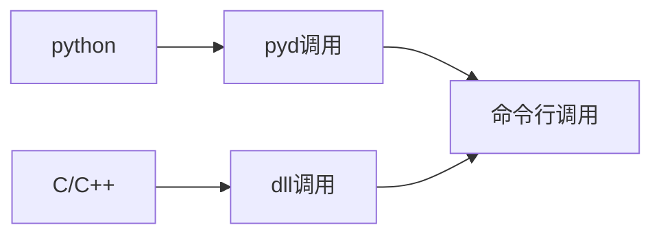

<div align="center">
    
    <h1>Clickmouse</h1>
    <br />
    一款快捷，简洁，轻便；使用python制作的鼠标连点器。
    <br />
    <a href="https://github.com/xystudiocode/pyClickMouse/actions/workflows/test.yml/">
        
    </a>
    <a href="https://github.com/xystudiocode/pyClickMouse/actions/workflows/deploy.yml/">
        
    </a>
    <a href="https://pypi.org/project/ClickMouse/">
        
    </a>
    <a href="https://img.shields.io/pypi/pyversions/ClickMouse">
        
    </a>
    <a href="https://github.com/gaogaotiantian/viztracer/blob/master/LICENSE">
        
    </a>
    <a href="https://github.com/xystudiocode/pyClickMouse/commits/master">
        
    </a>
    <!-- <a href="https://github.com/sponsors/xystudio889">
        
    </a> -->
    <br />
    <a href="https://github.com/xystudio889/clickmouse/releases">
        
    </a>
    <a href='https://xystudiocode.github.io/clickmouse/'>
        
    </a>
    <a href='https://github.com/xystudiocode/pyClickMouse/'>
        
    </a>
    <br />
    <a href="./README.md"></a>
    <a href="./README-zh_CN.md"></a>
</div>

---

> [!IMPORTANT]
> clickmouse主程序是main.exe,如果要运行clickmouse请点击main.exe,不要点击其他文件

> [!TIP]
> 我们不会在gitee上处理issue和pr，请使用github。

## 🅱️版权声明
<a target="_blank" href="https://icons8.com/icon/13347/mouse">鼠标</a> 的图标 <a target="_blank" href="https://icons8.com">Icons8</a>

## 📄介绍
一款快捷，简洁，轻便；使用python制作的鼠标连点器。

这个软件可以有较多的版本，基本都是C/C++调用版本、python调用版本和命令行交互版本。

## 📚使用的第三方库和使用的功能

### 🐍python
#### 📔需要使用的库
- PySide6：对于gui界面，他是图形核心框架
- pyautogui：鼠标连点器核心
- requests：用于检查版本号
- nuitka：打包为gui或~~交互式命令行~~的库
- cython：打包为pyd的库
- setuptools：打包为python包的库
- pywin32:win32控制
- pynput: 键盘控制库
- pyperclip: 剪贴板库
- psutil: 进程管理库
- packaging: 版本管理库
- pytz: 时区管理库

#### 📖clickmouse官方制作的库
- clickmouse: 连点器管理库
- clickmouse_api: 扩展制作的调用api

### ⬇️快速安装
输入`pip install -r requirements.txt`安装

## 🛠️支持调用的工具
- [x] C/C++头文件调用 使用原本C++版本的clickMouse改装而来 速度最快，兼容性最好，但是使用失效的可能性最大。可以从[releases](https://github.com/xystudiocode/pyClickMouse)下载
- [x] 使用原本C++版本的clickMouse 速度最快，兼容性最好，但是使用失效的可能性最大，已经停止更新，可以从[releases](https://github.com/xystudiocode/pyClickMouse)下载，[之前的clickmouse项目](https://github.com/xystudio889/ClickMouse)
- [x] 使用.dll调用 基于C++语言，速度最快，兼容性较好，使用失效的可能性最大。(配置较难，推荐使用C/C++头文件)可以从[releases](https://github.com/xystudiocode/pyClickMouse)下载
- [x] (开发人员推荐)python调用 速度中等，兼容性最好，使用失效的可能性最小。可以使用`pip install clickmouse`下载
- [x] 使用.pyd调用 基于python语言，速度较快，兼容性较差（不同版本的python可能不兼容），使用失效的可能性较小。可以从[releases](https://github.com/xystudiocode/pyClickMouse)下载(单独编译仅需编译cython/目录)
- [x] (普通用户推荐)使用exe 使用 基于交互式命令行添加了gui。可以从[releases](https://github.com/xystudiocode/pyClickMouse)下载
- [ ] 使用交互式命令行 使用 基于python语言，比gui轻便。~~可以从[releases](https://github.com/xystudiocode/pyClickMouse)下载~~ 暂时没有该版本，敬请期待
- [ ] 使用标准命令行 使用 基于python语言。~~将会自带在gui版本和pip安装版本中~~ 暂时没有该版本，敬请期待
- [x] 精简版(ClickClean) 比exe gui版本更加精简，告别臃肿的无用功能。可以从[releases](https://github.com/xystudiocode/pyClickMouse)

## ⚒️安装和调用
Gui版本和~~命令行交互版本~~无需安装，直接运行即可。

C/C++头文件调用可以直接使用以下代码调用(需要配置include目录)
```C++
#include <clickMouse.h>
#include <iostream>
using namespace std;

int main(){
    cout << CLICKMOUSE_VERSION << endl; // 打印版本信息,若成功输出一串数字，则安装成功
    clickMouse(LEFT, 1000, 10, 10); // 连点10次左键，间隔为1000ms，按下时间为10ms
    return 0;
}
```

> [!IMPORTANT]
> 下载基于pyd的文件时候需要注意:必须下载是你python版本的文件(如`lickmouse.cp39-win_amd64.pyd`)仅支持python3.9(cp后面的是版本，如果你使用python3.13以后的版本，不需要下载后面有t的版本(除非你使用free thread开发))

python调用或.pyd调用可以直接使用以下代码调用：
```python
import clickmouse

clickMouse.click_mouse(clickmouse.LEFT, 1000, 10, 10) # 连点10次左键，间隔为1000ms，按下时间为10ms
```
~~命令行调用~~
```bash
ClickMouse.exe /h # 查看帮助
```
## 💻再次编译方法
见[协作文档](./CONTRIBUTING.md)，找到`## ⬇️配置仓库`这一段，按照说明配置仓库。
### 📊使用优先级
开发人员：

鼠标连点器会一直保持运行，直到关闭程序或手动停止。
目前支持暂停和停止功能。

## 🖥️Clickmouse 软件
clickmouse版本格式为：`A.B.C.D[(alpha | beta |.dev | rc) E]`
## 😊正式版本
正式版不带.dev、alpha、beta或rc后缀。

A位代表有重大更新，有代码级的变动。如1.0升级到2.0就重构了代码。

B位代表有普通更新，通常是更新一些大功能。

C位代表有修复更新，通常会更新一些小功能和一些bug。

D位代表版本代号，通常每A, B, C位有变动时候+1。也有可能A, B, C位没有变动，D位+1，这代表紧急更新，通常是修复几个重大影响的bug。

## 🅱️测试版本
测试版本带.dev、alpha、beta或rc后缀。

通常前面的`A.B.C.D`在一个测试周期内不变，代表下一个版本。

`.dev`代表早期开发更新，功能不稳定，bug很多，位于版本项目初期。这阶段新增的功能将会被放到实验室中，并默认关闭。

`alpha`代表晚期开发更新，功能不完善，bug较多，位于版本项目早期。这阶段新增的功能将会被放到实验室中，并默认关闭。

`beta`代表发布测试更新，功能完善，bug较少，不会再新增功能，位于版本项目中期。并且会逐步合并实验室中的feature。

`rc`代表预备发布版本，功能完善，bug较少，会修复一些重要安全问题或bug，最接近正式版，即将发布正式版，位于版本项目末期。

::: tip 提示
rc最后一个版本将直接合并到测试版，不再单独发布；功能完全一样。
:::
