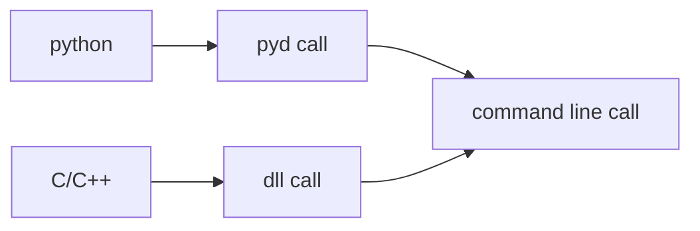

<div align="center">
    
    <h1>Clickmouse</h1>
    <br />
    A fast, simple, lightweight mouse clicker made with Python.
    <br />
    <a href="https://github.com/xystudiocode/pyClickMouse/actions/workflows/test.yml/">
        
    </a>
    <a href="https://github.com/xystudiocode/pyClickMouse/actions/workflows/deploy.yml/">
        
    </a>
    <a href="https://pypi.org/project/ClickMouse/">
        
    </a>
    <a href="https://img.shields.io/pypi/pyversions/ClickMouse">
        
    </a>
    <a href="https://github.com/gaogaotiantian/viztracer/blob/master/LICENSE">
        
    </a>
    <a href="https://github.com/xystudiocode/pyClickMouse/commits/master">
        
    </a>
    <!-- <a href="https://github.com/sponsors/xystudio889">
        
    </a> -->
    <br />
    <a href="https://github.com/xystudio889/clickmouse/releases">
        
    </a>
    <a href='https://xystudiocode.github.io/clickmouse/'>
        
    </a>
    <a href='https://github.com/xystudiocode/pyClickMouse/'>
        
    </a>
    <br />
    <a href="./README.md"></a>
    <a href="./README-zh_CN.md"></a>
</div>

> [!IMPORTANT]
> The main program of clickmouse is `main.exe`. To run clickmouse, please click `main.exe`, do not click on other files.

> [!TIP]
> We do not handle issues or PRs on Gitee, please use GitHub.

## 🅱️ Copyright Notice
Icon <a target="_blank" href="https://icons8.com/icon/13347/mouse">Mouse</a> by <a target="_blank" href="https://icons8.com">Icons8</a>

## 📄 Introduction
A fast, simple, lightweight mouse auto-clicker made with Python.

This software has multiple versions, mostly C/C++ callable versions, Python callable versions, and command-line interactive versions.

## 📚 Third-party libraries used and features utilized

### 🐍 Python
#### 📔 Required libraries
- PySide6: GUI framework core
- pyautogui: core of the auto-clicker
- requests: for version checking
- nuitka: for packaging as GUI or ~~interactive command line~~
- cython: for packaging as pyd
- setuptools: for packaging as Python package
- pywin32: Windows control
- pynput: keyboard control library
- pyperclip: clipboard library
- psutil: process management library
- packaging: version management library
- pytz: timezone management library

#### 📖 Official libraries made by clickmouse
- clickmouse: auto-clicker management library
- clickmouse_api: extended API for calling

### ⬇️ Quick install
Run `pip install -r requirements.txt` to install

## 🛠️ Supported calling tools
- [x] C/C++ header file call – adapted from the original C++ version of clickMouse; fastest, best compatibility, but most likely to become ineffective. Download from [releases](https://github.com/xystudiocode/pyClickMouse)
- [x] Original C++ version of clickMouse – fastest, best compatibility, but most likely to become ineffective; discontinued. Download from [releases](https://github.com/xystudiocode/pyClickMouse), [previous clickmouse project](https://github.com/xystudio889/ClickMouse)
- [x] .dll call – based on C++, very fast, good compatibility, most likely to become ineffective (harder to configure; C/C++ header file recommended). Download from [releases](https://github.com/xystudiocode/pyClickMouse)
- [x] (Recommended for developers) Python call – medium speed, best compatibility, least likely to become ineffective. Install via `pip install clickmouse`
- [x] .pyd call – based on Python, relatively fast, weaker compatibility (may be incompatible with different Python versions), less likely to become ineffective. Download from [releases](https://github.com/xystudiocode/pyClickMouse) (to compile separately, just compile the `cython/` directory)
- [x] (Recommended for regular users) EXE – GUI built on interactive command line. Download from [releases](https://github.com/xystudiocode/pyClickMouse)
- [ ] Interactive command line – based on Python, lighter than GUI. ~~Download from [releases](https://github.com/xystudiocode/pyClickMouse)~~ Not yet available, stay tuned
- [ ] Standard command line – based on Python. ~~Will be included in GUI version and pip install~~ Not yet available, stay tuned
- [x] Lightweight version (ClickClean) – more streamlined than the GUI EXE, eliminating bloated features. Download from [releases](https://github.com/xystudiocode/pyClickMouse)

## ⚒️ Installation and calling
The GUI version and ~~interactive command line version~~ require no installation; just run directly.

For C/C++ header file call, you can use the following code (requires include directory configuration):
```C++
#include <clickMouse.h>
#include <iostream>
using namespace std;

int main(){
    cout << CLICKMOUSE_VERSION << endl; // prints version info; if a number is output, installation succeeded
    clickMouse(LEFT, 1000, 10, 10); // click left button 10 times, interval 1000ms, press duration 10ms
    return 0;
}
```

> [!IMPORTANT]
> When downloading pyd-based files, make sure to download the version matching your Python version (e.g., `clickmouse.cp39-win_amd64.pyd` – cp39 means Python 3.9; if you use Python 3.13 or later, do not download versions with a `t` suffix unless you are using free-threaded development).

For Python call or .pyd call, use the following code:
```python
import clickmouse

clickmouse.click_mouse(clickmouse.LEFT, 1000, 10, 10) # click left button 10 times, interval 1000ms, press duration 10ms
```
~~Command line call~~
```bash
ClickMouse.exe /h # show help
```
## 💻 Recompilation instructions
See [Collaboration Document](./CONTRIBUTING.md), locate the `## ⬇️ Repository Setup` section and follow the instructions to set up the repository.

### 📊 Usage priority
Developers:

The auto-clicker will keep running until the program is closed or manually stopped.
Supports pause and stop functions.

## 🖥️ Clickmouse Software
Clickmouse version format: `A.B.C.D[(alpha | beta | .dev | rc) E]`

## 😊 Stable versions
Stable versions do not have suffixes like .dev, alpha, beta, or rc.

- A digit: major updates with code-level changes. For example, upgrading from 1.0 to 2.0 means a code refactor.
- B digit: regular updates, usually adding major features.
- C digit: patch updates, usually adding minor features and bug fixes.
- D digit: release identifier, incremented whenever A, B, or C changes. It may also increment without changes to A, B, C, indicating an emergency update that fixes several critical bugs.

## 🅱️ Test versions
Test versions have suffixes like .dev, alpha, beta, or rc.

Typically the preceding `A.B.C.D` remains unchanged during a test cycle and represents the next version.

- `.dev` – early development update, unstable features, many bugs, at the project's early stage. New features added during this phase are placed in the lab and disabled by default.
- `alpha` – late development update, incomplete features, many bugs, at the project's early stage. New features added during this phase are placed in the lab and disabled by default.
- `beta` – release candidate testing update, features complete, few bugs, no new features added; at the project's mid stage. Features from the lab are gradually merged.
- `rc` – release candidate, features complete, few bugs; will fix critical security or stability issues; very close to stable release; at the final stage of the project.

> [!tip]
> The last rc version will be merged directly into the test version and not released separately; the features are identical.