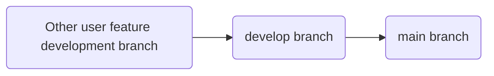

<script setup>
import caution from '@theme/components/caution.vue'
</script>

# Participating in Collaboration
## commit message

Need follow following format:
```
Update type(Update module):(optional)(version number) (Update summary):

- [(optional)Sub update type]Update content 1
- [(optional)Sub update type]Update content 2
- ...
```

Update types have these contents:
| Type | Description |
| --- | --- |
| ✅feat | New feature |
| 🔧modify | Modify feature |
| 🐛fix | Fix bug  |
| ⚒️refactor | Refactor |
| 📃docs | Modify documentation, e.g. README |
| ❇️style | Modify code style, not affecting functionality |
| 🔎test | Add test, modify test |
| 📆chore | Miscellaneous, e.g. modify .gitignore |
| ⏫perf | Performance optimization  |
| 🛒ci | CI/CD related changes |
| 🚅build | Modify build system or dependencies |
| ◀️revert  | Rollback |
| 🔡dependency | Dependency update |
| ❌remove | Remove deprecated components |
| ↪️move | Moved components |
| ❓unknown | Unknown type |
| Custom  | Try to describe with intuitive English word, best with emoji |

When content many need add update type prompt for update content

## Branches

Please update according to branch structure shown in this diagram:


Created branches need start with `feature/` to indicate feature branch, or create a fork, and develop in fork branch.

When publishing pr need select **merge to `develop` branch**.

## Version Number
clickmouse version format: `A.B.C.D[(alpha | beta |.dev | rc) E]`
## Official Version
Official version without .dev, alpha, beta or rc suffix.

A position represents major update, has code level changes. E.g. 1.0 upgrade to 2.0 refactored code.

B position represents normal update, usually updates some major features.

C position represents fix update, usually updates some minor features and some bugs.

D position represents version code, usually +1 when A, B, C positions change. Also possible A, B, C positions not change, D position +1, this represents emergency update, usually fixes several major impact bugs.

## Test Version
Test version with .dev, alpha, beta or rc suffix.

Usually preceding `A.B.C.D` unchanged during test cycle, represents next version.

`.dev` represents early development update, functionality unstable, many bugs, located at version project initial stage.The new features in this phase will be put in the lab and turned off by default.

`alpha` represents late development update, functionality incomplete, many bugs, located at version project early stage.The new features in this phase will be put in the lab and turned off by default.

`beta` represents release test update, functionality complete, fewer bugs, will not add new features, located at version project middle stage. It is usually released in the middle of the development cycle and will gradually merge features from the lab.

`rc` represents pre-release version, functionality complete, fewer bugs, will fix some important security issues or bugs, closest to official version, about to release official version, located at version project final stage.

## issue
- Title format: `[Type] Title` etc., can write casually, but need accurately describe update content.
- Content should accurately write your requirements, and optionally give solutions, upload screenshots, add additional information (e.g. clickmouse version number)
- Types are `bug`, `enhancement`, `question` etc.
- We provided some templates, can directly use.
- Use `labels` to mark issue type, e.g. `bug`, `enhancement`, `question` etc.
- Set issue `milestone` to version you want to apply.
- Security issues please see [Security Documentation](./SECURITY.md).

## pr
- Title format: `[Type] Title`
- Use `labels` to mark pr type, e.g. `bug`, `enhancement`, `question` etc.
- Associate issue, so we can know which issue this pr solves.
- Need accurately write update content, associate to version number milestone.
- Optionally add implementation ideas

### Specifications
Our pr merge order:


pr no specific format, but must clearly describe update content, associate to version number milestone; title need briefly describe update content, if fixed or added suggestions in issue, write that issue number in this line, if multiple duplicate issues appear, only write one, and simply describe this bug.

### Express pr
<caution title="Caution">
Express pr please use carefully
</caution>

- Express pr means skip some normal pr merge branch steps, to faster merge to target branch functionality.
- Title format: `[✈️Express] Title`
- Using express must explain reason in pr description

If someone express merge, but didn't write express merge reason, then reject merge that person's branch.

Express pr has high priority, will process first.

## milestone
- We set a milestone for each version, to manage that version's issues and pr.
- Need each issue or pr associate to a milestone, so we can know if that issue or pr added in next version.
- milestone format:`dev_version number`