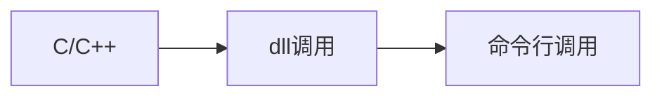

<script setup>
    import important from '@theme/components/important.vue'
</script>

# header/dll调用

本文介绍了如何使用Python调用pyd文件。

## 下载

前往[github releases](https://github.com/xystudiocode/pyClickMouse/releases)，找到最新版本有.h或dll的版本文件。

<important text='重要'>
在下文，<code>CLICKMOUSE_CLASS</code>在dll中指<code>int</code>，在header调用中指<code>void</code>。
</important>

## 函数库

`ClickMouse`函数：
- 定义：
```cpp
CLICKMOUSE_CLASS ClickMouse(
    unsinged int MouseButton, 
    unsigned int delay, 
    unsigned int pressTime, 
    int times = 1
)
```
- 参数：
- - MouseButton:按下的键位，可选`LEFT`或`RIGHT`
- - delay:点击延迟
- - time:点击次数，默认为1次，如果是`INFINITE`则为无限 

`LeftClick`函数：
```cpp
CLICKMOUSE_CLASS LeftClick(
    int times = 1, 
    unsigned int delay, 
    unsigned int pressTime
)
```
等同于`ClickMouse(LEFT, delay, pressTime, times)`

`RightClick`函数：
```cpp
CLICKMOUSE_CLASS RightClick(
    int times = 1, 
    unsigned int delay, 
    unsigned int pressTime
)
```
等同于`ClickMouse(RIGHT, delay, pressTime, times)`

## 示例
```cpp
#include <clickMouse.h>
#include <iostream>
using namespace std;

int main(){
    cout << CLICKMOUSE_VERSION << endl; // 打印版本信息,若成功输出一串数字，则安装成功
    clickMouse(LEFT, 1000, 10, 10); // 连点10次左键，间隔为1000ms，按下时间为10ms
    return 0;
}
```
## 使用优先级
