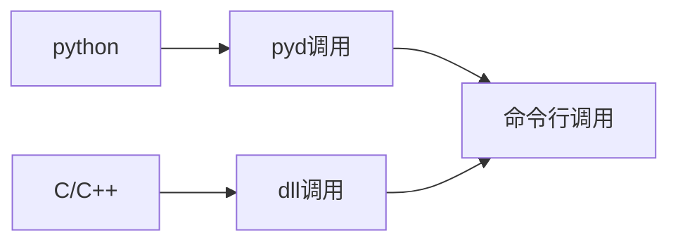

# 介绍

clickmouse库是一款开源的控制鼠标库，可以进行鼠标连点的操作。

## clickmouse库

clickmouse库是用于控制鼠标的库，可以模拟鼠标点击操作。

选择右侧的文档进行查阅。

## 调用方法
调用方法有：
- ✅ C/C++头文件调用 使用原本C++版本的clickMouse改装而来 速度最快，兼容性最好，但是使用失效的可能性最大。可以从[releases](https://github.com/xystudiocode/pyClickMouse/releases)下载
- ✅ 使用原本C++版本的clickMouse 速度最快，兼容性最好，但是使用失效的可能性最大，已经停止更新，可以从[releases](https://github.com/xystudiocode/pyClickMouse/releases)下载，[之前的clickmouse项目](https://github.com/xystudio889/ClickMouse)
- ✅ 使用.dll调用 基于C++语言，速度最快，兼容性较好，使用失效的可能性最大。(配置较难，推荐使用C/C++头文件)可以从[releases](https://github.com/xystudiocode/pyClickMouse/releases)下载
- ✅ (开发人员推荐)python调用 速度中等，兼容性最好，使用失效的可能性最小。可以使用`pip install clickmouse`下载
- ✅ 使用.pyd调用 基于python语言，速度较快，兼容性较差（不同版本的python可能不兼容），使用失效的可能性较小。可以从[releases](https://github.com/xystudiocode/pyClickMouse/releases)下载(单独编译仅需编译cython/目录)
- ❌ 使用标准命令行 使用 基于python语言。~~将会自带在gui版本和pip安装版本中~~ 暂时没有该版本，敬请期待

## 使用优先级
