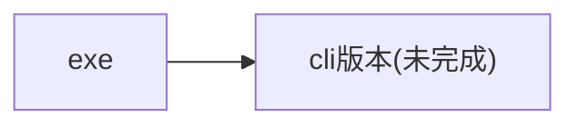

# Clickmouse 指南

## 介绍
Clickmouse指南，主要介绍Clickmouse gui的使用方法、功能、原理、配置等。

点击侧边栏以进行查阅。

## 功能
- 连点功能
- 输入间隔
- 热键启动
- 输入次数
- 自动检查更新
- 自动下载和安装更新
- 设置
- 官方安装助手
- 包管理
- 后台运行

## 调用方法
- [x] C/C++头文件调用 使用原本C++版本的clickMouse改装而来 速度最快，兼容性最好，但是使用失效的可能性最大。可以从[releases](https://github.com/xystudiocode/pyClickMouse/releases)下载
- [x] 使用原本C++版本的clickMouse 速度最快，兼容性最好，但是使用失效的可能性最大，已经停止更新，可以从[releases](https://github.com/xystudiocode/pyClickMouse/releases)下载，[之前的clickmouse项目](https://github.com/xystudio889/ClickMouse)
- [x] 使用.dll调用 基于C++语言，速度最快，兼容性较好，使用失效的可能性最大。(配置较难，推荐使用C/C++头文件)可以从[releases](https://github.com/xystudiocode/pyClickMouse/releases)下载
- [x] (开发人员推荐)python调用 速度中等，兼容性最好，使用失效的可能性最小。可以使用`pip install clickmouse`下载
- [x] 使用.pyd调用 基于python语言，速度较快，兼容性较差（不同版本的python可能不兼容），使用失效的可能性较小。可以从[releases](https://github.com/xystudiocode/pyClickMouse/releases)下载(单独编译仅需编译cython/目录)
- [x] (普通用户推荐)使用exe 使用 基于交互式命令行添加了gui。可以从[releases](https://github.com/xystudiocode/pyClickMouse/releases)下载
- [ ] 使用交互式命令行 使用 基于python语言，比gui轻便。~~可以从[releases](https://github.com/xystudiocode/pyClickMouse/releases)下载~~ 暂时没有该版本，敬请期待
- [ ] 使用标准命令行 使用 基于python语言。~~将会自带在gui版本和pip安装版本中~~ 暂时没有该版本，敬请期待
- [x] 精简版(ClickClean) 比exe gui版本更加精简，告别臃肿的无用功能。可以从[releases](https://github.com/xystudiocode/pyClickMouse/releases)

## Usage
- [x] C/C++ header file usage: Use the original clickMouse re-packaged as C++ version, which is fast and compatible, but the maximum susceptibility to invalid use. You can download from [releases](https://github.com/xystudiocode/pyClickMouse/releases)
- [x] Original C++ version usage: Use the original clickMouse, which is fast and compatible, but the maximum susceptibility to invalid use, and has stopped updating. You can download from [releases](https://github.com/xystudiocode/pyClickMouse/releases)
- [x] dll calling: Based on C++ language, which is fast and compatible, but the maximum susceptibility to invalid use. (The configuration is more difficult, it is recommended to use C/C++ header file) You can download from [releases](https://github.com/xystudiocode/pyClickMouse/releases)
- [x] (Developer recommended) Python calling: Slow, but compatible, and the minimum susceptibility to invalid use. (Recommended to use `pip install clickmouse`) You can download from [releases](https://github.com/xystudiocode/pyClickMouse/releases)
- [x] .pyd calling: Based on python language, which is faster, but compatible (different versions of python may not be compatible), and the susceptibility to invalid use is relatively small. You can download from [releases](https://github.com/xystudiocode/pyClickMouse/releases) (only need to compile cython/ directory)
- [x] (General user recommended) exe usage: Based on interactive command line with gui. You can download from [releases](https://github.com/xystudiocode/pyClickMouse/releases)
- [ ] Interactive command line usage: Based on python language, lightweight than gui. (~~You can download from [releases](https://github.com/xystudiocode/pyClickMouse/releases)~~) Not yet available, please wait.
- [ ] Standard command line usage: Based on python language. (~~Will be included in the gui version and pip installation version~~) Not yet available, please wait.
- [x] Simplified version (ClickClean) is more lightweight and eliminates unnecessary functions. You can download from [releases](https://github.com/xystudiocode/pyClickMouse/releases)

## 连点功能
- 鼠标连点
- 自定义连点间隔
- 自定义连点次数

## ⬇️下载
前往[releases](https://github.com/xystudiocode/pyClickMouse/releases/releases)下载

## 使用优先级
